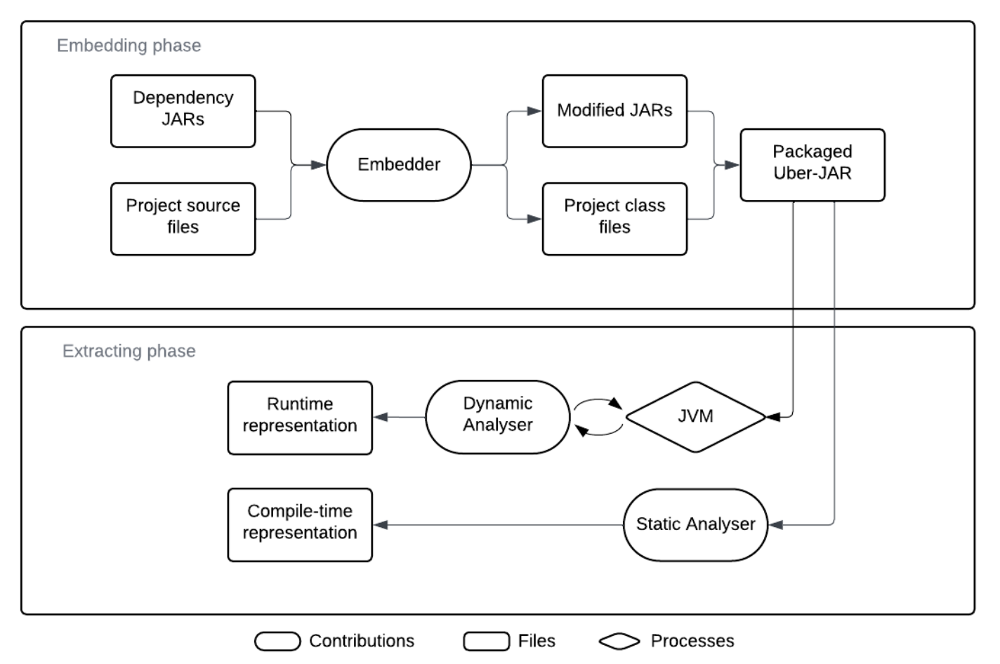

# Classport

## About

**Classport** is a collection of tools that work together to enable **accurate runtime inspection of the supply chain in Maven Java programs**. 

Classport's main objective is to make software supply chain information available at runtime.

To reach this goal it:

* **Embeds** supply chain metadata in each class file that is to be part of the application during build time.
* **Monitors** the class loaded by the running application and **extracts** the embedded Software Supply Chain information from the loaded classes. 

In this way, Classport is able to accurately connect the loaded classes to their corresponding upstream dependencies and build a runtime representation of the application’s code-related supply chain.


## Structure



The picture gives an overview of the structure of Classport. The structure is divided into two phases: **Embedding phase** and **Extracting Phase**.

### Embedding Phase

The inputs of this phase are the dependency JARs and the project source files.
The embedder is responsible for embedding the supply chain information in the form of Java Annotations into the class files.
This feature is implemented by the Maven plugin that
modifies the JAR files during the build process and is contained in the `classport.commons` package.

The embedded class files can be packaged together with the application, or just added to the classpath in place of the "regular" versions of the class files. 
### Extracting Phase

This is the phase in which the supply chain information is extracted.  
It can be done dynamically or statically.

#### Dynamic Analyser

The `classport.agent`
package contains a Java agent that can be run alongside the Classport-ified JAR.
This agent logs all the supply-chain data for classes that get loaded,
and prints a dependency tree from these at the end. This way, the dependency tree
will consist of only those dependencies that were actually used at runtime.

#### Static Analyser

The `classport.analyser` package contains two tools for statically analysing
and modifying JAR files.


## Usage

Package all the modules. From the root of the Classport project:

```console 
mvn package
```

Use the Maven plugin to embed supply chain information into the class files of the project using the `embed` goal. From the root directory of the analysed Maven project:

```console
mvn io.github.chains-project:classport-maven-plugin:0.1.0-SNAPSHOT:embed
```
The `embed` goal of the Maven plugin retrieves a list of project dependencies and their corresponding JAR files, embeds the annotation into all class files within each JAR, and recreates what can be seen as a dependency-only Maven local repository in the `classport-files` directory.

The JAR files from within there can then be included in the class path with the `-cp` flag as per usual.

For projects that get packaged into an Uber-JAR:

```console
mvn package -Dmaven.repo.local=classport-files
```

For multi-module projects, package each project separately as dependency properties
may differ (e.g. a direct dependency for one module is a transitive one for another).

### Dynamic analysis
Use the agent to detect the used classes:

```console
java -javaagent:<path-to-agent-jar> -jar <path-to-app-jar>
```

This command outputs the **runtime representation** of the software supply chain of the analysed project:
- `classport-deps-list` --> flat list of dependencies
- `classport-deps-tree` --> tree of dependnecies

### Static analysis

This is the command to perform static analysis:
```console
java -jar <path-to-analyzer-jar> -<printList|printTree|generateTestJar> <jarFile> [classes-to-be-ignored]
```

The available flags are:
* `-printList`, for statically generating a flat list of dependencies.
* `-printTree`, for staticaly generating a dependencies tree.
* `-generateTestJar`, for generating a JAR file where the main class has been modified to force-load classes from all dependencies.

## Requirements

* Maven 
* Java >= 17

## The thesis behind this project

[The Embedding and Retrieval of Software Supply Chain Information in Java Applications](https://kth.diva-portal.org/smash/record.jsf?dswid=7855&pid=diva2%3A1905606&c=1&searchType=SIMPLE&language=en&query=The+Embedding+and+Retrieval+of+Software+Supply+Chain+Information+in+Java+Applications&af=%5B%5D&aq=%5B%5B%5D%5D&aq2=%5B%5B%5D%5D&aqe=%5B%5D&noOfRows=50&sortOrder=author_sort_asc&sortOrder2=title_sort_asc&onlyFullText=false&sf=all)
