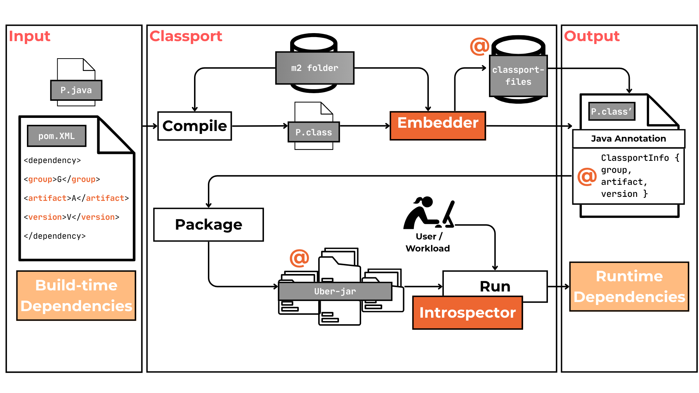

<div align="center">


[](LICENSE)

</div>

# Classport

**Classport** is a *passport for Java classes*.

It is a JVM instrumentation agent and Maven plugin that embeds and retrieves dependency metadata (GAV: Group, Artifact, Version) directly from Java `.class` files. It enables runtime introspection of runtime dependencies in Java.


## 🎯 Motivation

Java applications often rely on third-party libraries via Maven, but all dependency metadata is lost once the application is packaged and deployed. This creates blind spots for:
- Vulnerability scanners
- Runtime permission enforcement

🧩 **Classport solves this by preserving dependency origin metadata all the way to runtime.**


## 🚀 Key Features

- 🔍 Embeds Maven GAV coordinates as runtime-visible annotations into compiled `.class` files.
- 🎯 Retrieves this metadata at runtime using a lightweight Java agent.
- 🧪 Compatible with real-world projects and benchmarks (see [`classport-experiments`](https://github.com/chains-project/classport-experiments)).

## ⚙️ How It Works

Classport has two components:

| Component    | Description |
|--------------|-------------|
| 🧵 [**Embedder**](./maven-plugin/)  | A Maven plugin that injects GAV metadata as Java annotations into every `.class` file. |
| 🕵️ [**Introspector**](./classport-instr-agent/) | A Java agent that dynamically inspects dependencies at runtime to retrieve their GAV info. |



## 🛠️ Getting Started
### Requirements
* Java 17+
* Maven 3.8+

### Setup
Clone and install the project.

```bash
git clone git@github.com:chains-project/classport.git
cd classport
mvn clean install -DskipTests
```

### How to use

In order to achieve runtime dependencies introspection with classport, you have to first embedd and then to run the instrospector together with you application.

1. Embed
Inside the target project folder.
```bash
mvn compile io.github.project:classport-maven-plugin:0.1.0-SNAPSHOT:embed
mvn package -Dmaven.repo.local=classport-files -DskipTests
```
Note: if the project has more than one module, it is required to merge all the `classport-files` folders and use this as a Maven local repo during the packaging phase. 

2. Introspect
```bash
java -javaagent:<path-to-classport-agent-jar>=<name-of-the-project>,<path-to-output-dir>,dependency -jar <path-to-jar-of-the-target-app> [optional-args-of-the-target-app]
```
Note:
- `name-of-the-project` can be any name and it is used to build the name of the output file.
- `path-to-output-dir` must be a path of an existing folder

### Example of usage
Run the following command from the root folder of Classport

```bash
cd resources/simple-app-monitoring
mvn clean

# Embed
mvn compile io.github.project:classport-maven-plugin:0.1.0-SNAPSHOT:embed
mvn package -Dmaven.repo.local=classport-files -DskipTests

# Introspect
mkdir output
java -javaagent:../../classport-instr-agent/target/classport-instr-agent-0.1.0-SNAPSHOT.jar=test,./output,dependency -jar target/test-agent-app-1.0-SNAPSHOT.jar
```
In the output folder there will be the csv file with the resulting detected runtime dependencies.

This is the expected output.
```
group,artefact,version
org.apache.commons,commons-lang3,3.17.0
com.example,test-agent-app,1.0-SNAPSHOT
```
